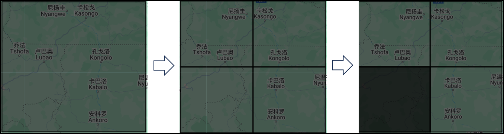
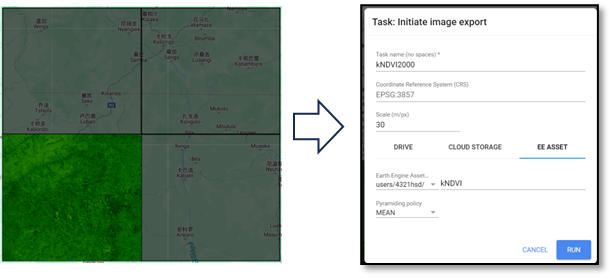
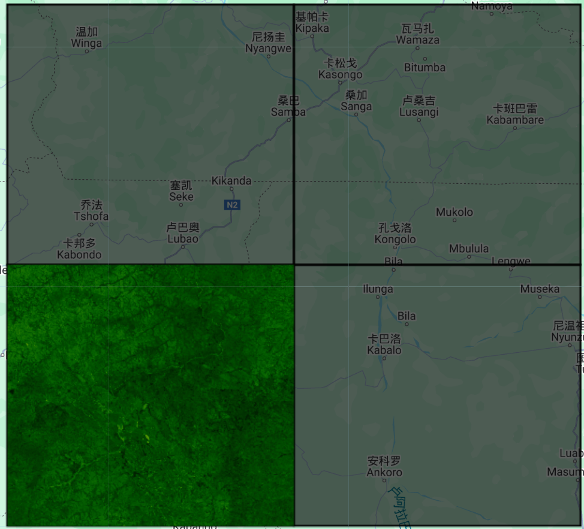

# kNDVI
kNDVI Calculation in Google Earth Engine

---

## **Overview**  
This script calculates the kernel Normalized Difference Vegetation Index (kNDVI) for the years 2000 and 2023 using Landsat imagery in Google Earth Engine (GEE). To optimize computation over large study areas, a grid-based partitioning approach is used. The script follows three main steps:

## **Process Flow**  

1. Study Area Partitioning: The study area is divided into four subregions, allowing the user to select a specific subregion for processing.

  
**Fig1.** Study area division step by step calculation

2. kNDVI Computation for 2000: Uses Landsat 5/7 imagery with cloud masking, computes kNDVI, visualizes the results, and exports them to GEE assets.

  
**Fig2.** kNDVI spatial distribution of substudy area 1 in 2000

3. kNDVI Computation for 2023:Follows the same process with Landsat 8/9 imagery, adjusting band selections accordingly. 

{width=100 height=100}
**Fig3.** kNDVI spatial distribution of substudy area 1 in 2023

## **How to use**

Modify `roi2 = subroi.filterMetadata('grid_id', 'equals', X);` to select a subregion (1-4).  
Run the script to compute and visualize kNDVI for 2000 and 2023.  
The results are exported as `toUint32()` to optimize storage.

## **Notes** 
 Large study areas may exceed GEE's memory limits.  
 Ensure sufficient asset storage before exporting.

## License
Certain implementations within this repository are currently patent-pending.  
Use of this code must comply with the patent clause of the **Apache 2.0 License**.

